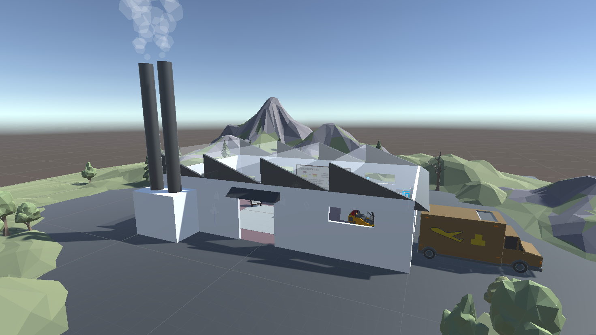
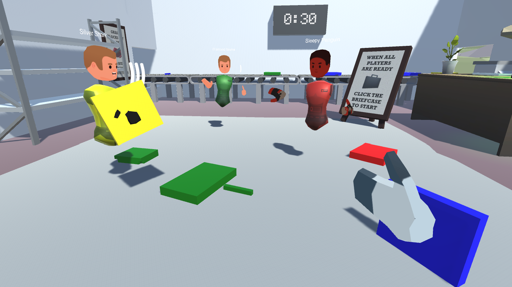
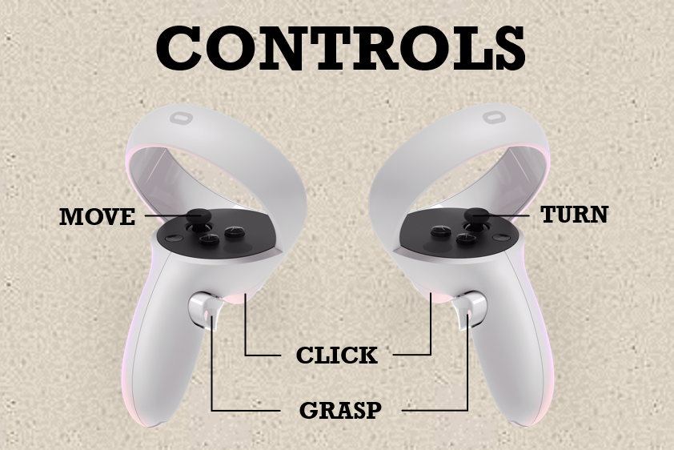

# Blockism: A social VR building game


Collaboration is key! This is a social virtual reality building game where players work together to build structures and score points before time runs out. The game is built within the Unity ecosystem along with the [Ubiq](https://github.com/UCL-VR/ubiq) library for networking support.

## Overview


Set in a fictional factory, each player is given a colour; red, yellow, green, or blue. Once all players are present, the game begins by touching the suitcase. When the game starts the conveyer belt will present blocks of assorted colours to the players. The colours of these blocks correspond to the player colours that are in the game. Players are only able to pick their own-coloured blocks, which are then combined to create structures. The colour mechanic forces players to build structures together. Once a structure is complete it may then be dropped-off at the submission zone to score points.

## Build Instructions

### Oculus Quest 2
```bash
TBC
```
#### Oculus Touch Controls:


### Desktop
```bash
TBC
```

### Unity Editor
```bash
TBC
```

## Acknowledgements
### Main Authors
- [Daniel Costa Matos](https://github.com/clsbcosta)
- [Harvey Mannering](https://github.com/harveymannering)
- [Praveen Selvaraj](https://github.com/pravsels)
- [Daniel Chipping](https://github.com/dchipping) 

### Public Domain Unity Assets
- [Low Poly Storage Pack](https://assetstore.unity.com/publishers/12124): Broken Vector
- [Low Poly Forklift](https://assetstore.unity.com/packages/3d/props/industrial/low-poly-forklift-176653): Polygon-Park
- [Polygon Starter Pack](https://assetstore.unity.com/packages/3d/props/polygon-starter-pack-low-poly-3d-art-by-synty-156819): Synty Studios
- [Veichles PolyPack](https://assetstore.unity.com/packages/3d/vehicles/vehicles-polypack-187691): Alstra Infinite
- [Low Poly Office Props Lite](https://assetstore.unity.com/packages/3d/environments/low-poly-office-props-lite-131438): Robert Ramsay
- [Polyonal's Low-Poly Particle Pack](https://assetstore.unity.com/packages/vfx/particles/polygonal-s-low-poly-particle-pack-118355): Polygonal Stuff

### Techical Assistance
- TBD
