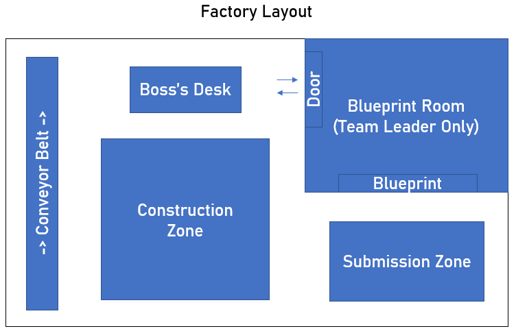

## Game Design

### What each class does? i.e. (Red Class vs. Blue Class)
- Only picks its own colour up

### Teaching level to you discover game dynamics
- Book with blueprints in them which tell you how to build the structures
- No time limit
- Noise Cues
- Text help

### Narrative behind the game e.g. Boss in Factory, Building a tower to escape water etc.
- Boss Factory: Players are tasked with certain designs by the boss
    - Conveyor belt where a certain number of blocks off
    - Money incentive, taking pieces cost and building blocks awards money
    - Structures mimic furniture (IKEA etc. for inspiration)
    - One person has access to the blueprints/order and has to relay the info back to the team on the order
    - Structures can be built block-by-block
    - Workshop area to add complexity
    - Area to drop order items off, if timer runs out whatever is in the area is what you get scored for
    - 5 orders per level

### Environments Asthetics
- Room with construction pad in middle
- Conveyor belt on one side
- Blueprint behind a island wall on other side
- Looks like a factory
- Area orders are placed into

### Events based class changes
- Using a book for blueprints - only a certain class can see certain designs
- Changing roles within the group e.g. someone collects design, else build etc.
- Color Blinding Mechanics

---

## Feature Breakdown

### Block/Structures
- Design 5 structures and their constituent blocks
- Implement all strcutures and their blocks as assets into Unity
- Mechanic to enforce blocks can only be built in construction zone

### Goal Setting
- Implement blueprint generation mechanic i.e. table w/ max 4 colours *if* 4 players, table w/ max 2 colours *if* 2 players for each structure
- Design order generation mechanic (order consistent of x many blueprints/items, dependent on difficulty)
- Blueprint graphic generation and rendering in VE
- Design simple money scoring system
- Implement checking mechanic for strctures placed in submission zone
- Design world timer mechanic

### Class System
- Implement upto 4 colour class system based on number of players in game
- Design team leader mechanic, can only view blue print and random assignment of the role each game

### Conveyor Belt
- Create conveyor belt which continually moves
- Add block spawning/disappearing dynamic

### Environments
- Create boxed world
- Add texturing graphics to look like factory
- Area for conveyor belt 
- Area for structure submission
- Island wall to render blueprints on
- Area for boss NPC

### Story
- Boss NPC
- Verbal/Audio cues to do certain tasks

---

## Environment Layout

---

## Archived Ideas
- Escape the Room: Use objects to escape through a hatch/rising water etc.
    - Factory is designed as Maze so players have to find blocks
    - Delivery comes in at timed intervals with blocks to find
